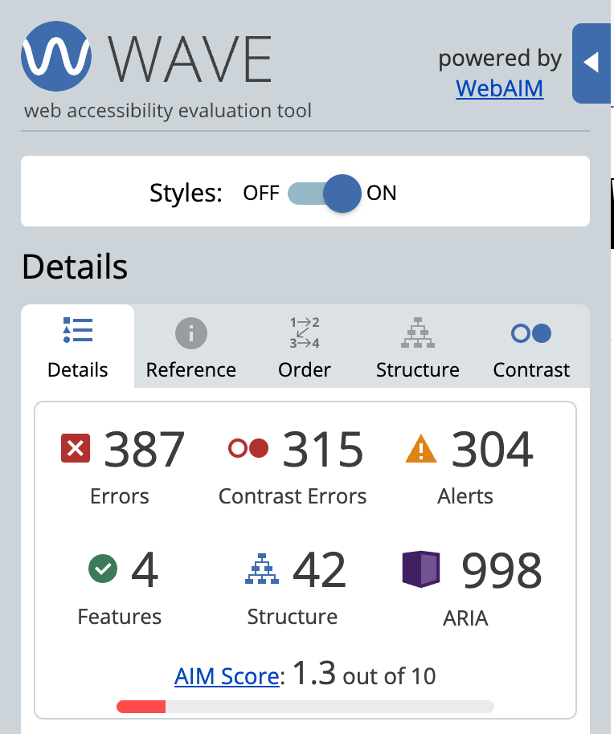
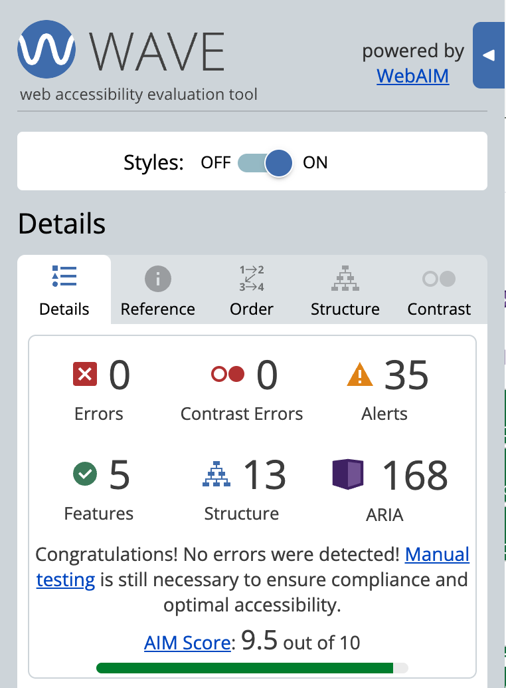

# Fireflies, Meeting Detail redesigned

An improved version of the Fireflies meeting / transcript detail view, rebuilt on a design system I built from scratch. Frontend only, mock data, no backend. The focus is interaction, craft, accessibility, and a layout that holds up from wide desktop down to a phone in landscape.

- **Live demo:** https://fireflies-ai.vercel.app/
- **Repo:** https://github.com/philson-philip/fireflies.ai
- **Stack:** React 18, JavaScript, Vite, Tailwind CSS, lucide-react (icons only). No third party UI kit.

---

## Why this screen

Because my new account lacked historical seed data, the home dashboard was mostly empty and didn't give me enough surface area to judge meaningfully. In contrast, the meeting / transcript detail view is the core surface of a note taker—it is where people actually spend their time, and it is where design craft is most visible. So I picked it for both the audit and the rebuild.

---

## Part 1, Product, Craft and Systems audit

### Product judgment

**What deserves the most attention, and what currently gets too much.** The transcript is the core artifact of the product, yet in the live app it sits visually secondary to the summary and competes with a left panel and the center column for the eye. At some widths the transcript text is clipped on the right edge, so the most important content is the least readable. The recent activity, repeated upsell prompts, and chrome receive more attention than they earn.

**If I removed 20 to 30 percent, what goes first.** The redundant "download the desktop app" promotions that appear in the profile menu, the notifications panel, and the AskFred connect banner. The repeated speaker headers that print on every consecutive line by the same person. Cutting these returns vertical space to the transcript and the summary.

**The single highest leverage improvement.** Make the transcript primary and fully readable. Stop the horizontal clipping, let the text reflow when the pane is resized, and give the reading column a clear visual hierarchy.

**Details most users never notice, but I would still fix.** The active transcript line was colored in a red or pink that reads as an error state. The notifications panel header said "0 Notifications" while the body said "No notification yet", a singular and plural mismatch. The feedback modal used plain numbered boxes from 1 to 5 instead of a clear rating control. Icon tooltips opened with a noticeable lag.

### Craft review

The most impactful issues I found, grouped so the structure reads as a system rather than a bug list.

1. **Accessibility improvements needed.** Required across the board to meet WCAG standards, including proper semantic landmarks, focus management, and passing color contrast.
2. **Transcript clipping and no reflow.** Text was cut off at certain widths and did not re justify when the panel was dragged.
3. **Broken layout on banner dismiss.** Closing the trial banner left a dead gap and an overlapping "sync with audio" control colliding with a transcript row.
4. **Inconsistent panel width across tabs.** Each left tab rendered at its own width, so switching tabs visibly shifted the whole layout.
5. **Right panel resize broke when the left panel was open.**
6. **Active line color.** The now playing line used a red or pink that means error, and a different cream highlight appeared elsewhere, so there were two competing treatments.
7. **Repeated speaker headers.** Consecutive turns by one speaker reprinted the full avatar, name, and timestamp on every line.
8. **Toastr UI.** Positioned center which overlaps the player controls, and missing semantic colors.
9. **Sidebar motion.** The expand and collapse animation was rough and the collapse trigger was weak and hard to find.
10. **Icon buttons.** Missing tooltips and accessible labels, plus a laggy tooltip delay.

The observations span general usability, visual and information hierarchy, interaction quality, and accessibility.

### Systems thinking

Most of the issues above are symptoms of missing primitives, not one off bugs. I standardized:

- **Card.** One container with consistent spacing, radius, and border, used for bookmarks, AI Skills, comments, and panel rows. In the live app each of these reinvents the card.
- **Badge with semantic tokens.** Sentiments, filter categories, and bookmark types (Important, Positive, Concern) all draw from one set of semantic colors, which also fixes the incoherent color usage.
- **IconButton.** Every icon control routes through it, so each one is guaranteed an accessible label and a tooltip.
- **Avatar.** Speaker color is derived deterministically from the name, so the same person reads the same color in the transcript, the talk time list, and the attendee chips.
- **Layout primitive.** The three sidebar bugs (width jump, broken resize, rough motion) are really one missing layout primitive. Solving it once fixes all three.

This is the same argument I lived at BigBinary, where I built NeetoUI across 20 plus products and cut frontend development time by about 70 percent. A primitive makes the next feature consistent by default.

---

## Part 2, what I built and changed

A side by side of the live app and the rebuild.

### Fixed broken UI

- The transcript no longer clips. Panes use a zero minimum width with normal wrapping, so text always wraps inside its column and re justifies live as the pane is dragged.
- The layout is stable. There is no dead gap or overlapping control, because the structure is grid and flex stable rather than absolutely positioned fragments.
- The transcript pane is resizable through an accessible separator, and resize works whether or not the left panel is open.
- The left panel is a fixed width for every tab, so switching tabs no longer shifts the layout.

### Layout and typography

- Clear hierarchy. The transcript is the primary reading column, the summary is a scannable label and value digest, and the left panel is a single, predictable surface.
- A role driven type scale (display, H1 to H4, body, label, caption) on DM Sans for headings and controls and Inter for body, with consistent line height and spacing.
- Speaker turns are grouped, so a single header covers a run of lines by the same person instead of repeating on every line.
- Semantic status throughout. Sentiments, filters, bookmarks, and AI Skills all use one set of semantic tokens, with active states (a check on a selected filter or sentiment) so the current selection is obvious.
- The now playing line uses a brand tint, never red, and updates as playback moves.

### Accessibility, verified

This was the largest area of work. I rebuilt the chrome as real landmarks and ran the result through the WAVE evaluation tool.

| WAVE result | Live Fireflies | This rebuild |
| --- | --- | --- |
| Errors | 387 | 0 |
| Contrast errors | 315 | 0 |
| Alerts | 304 | 35 |
| AIM score | 1.3 / 10 | 9.5 / 10 |

<p align="center">
  
  &nbsp;
  
</p>

What changed to get there:

- **Real semantics.** The top bar is a `header` with a `nav`, the rail is a `nav`, and every control is a real `button` or link. The live app renders these as generic, non focusable divs, which is the root of most of its errors.
- **Keyboard operable everywhere.** Full focus order through rail, panel, summary, transcript, and player, with a visible `:focus-visible` ring on every interactive element. The transcript resize separator works with the arrow keys.
- **Labels on everything.** Every icon button has an accessible name and a tooltip, since they all route through one primitive.
- **Color that passes AA.** I retuned the semantic palette so success, warning, danger, and info all meet contrast on white. The live app uses teal for success, which fails as text. This is the main reason its 315 contrast errors dropped to zero.
- **Inputs done right.** Labels are associated, helper and error text are wired with `aria-describedby`, and errors are never signaled by color alone.
- **Honest note.** WAVE still reports 35 advisory alerts and recommends manual testing. Alerts are advisory, not failures, and I treated zero errors plus zero contrast errors as the bar, with manual keyboard and screen reader passes on top.

### Animation and motion

Motion is purposeful and quiet, never decorative.

- The left panel expands and collapses smoothly with a single eased curve, replacing the rough animation in the live app, and the collapse trigger is now clear and easy to find.
- Interactive states (hover, active, tab selection, the now playing line) transition on a shared easing token, so the whole interface feels consistent rather than each element animating differently.
- Toasts animate in from the corner with a short, eased entrance.
- Everything respects `prefers-reduced-motion`. If a user asks the system to reduce motion, transitions and animations effectively turn off.

### Responsive, portrait and landscape

- **Desktop.** Rail, summary, and a resizable transcript side by side, with a draggable divider.
- **Mobile portrait.** A single column with a Summary and Transcript segmented switch, since the two panes cannot sit side by side on a phone. The metadata row wraps cleanly instead of collapsing into cramped columns, and the player bar reduces to its essential controls.
- **Mobile landscape.** The same single column adapts to the short viewport height. The header, content, and player bar stay usable without clipping, which is where the live app's fixed layout falls apart.

### Other improvements over the scaffold

- Progress bar scrubbing with a time tooltip that shows the target position while dragging.
- A Topic Trackers section with a proper empty state.
- Bookmarks rendered as semantic cards (Important, Positive, Concern) on the shared Card and Badge primitives.
- The AI Skills tab built out with the meeting insight actions.

---

## Design system

Anchored in the Fireflies brand, purple `#7A5AF8` with DM Sans and Inter on a 4px rhythm, but built from scratch and owned here. No third party UI kit.

- **Tokens** live as CSS variables in `src/index.css` and are surfaced into Tailwind in `tailwind.config.js`. Components consume tokens through Tailwind classes, never hardcoded values. The tokens are structured so a dark theme is a drop in.
- **Primitives** in `src/components/ui`: Button (primary, secondary, ghost, disabled), Input (label, helper, error), Card, Badge (semantic tones), Avatar, IconButton, Tooltip, Toast.
- **Feature components** in `src/components/meeting`. Mock data in `src/data/meeting.js`.

---

## Run locally

```bash
npm install
npm run dev      # http://localhost:5173
npm run build    # production build to /dist
npm run preview  # serve the build
```

Deploy on Vercel with the Vite preset, build command `npm run build`, output directory `dist`, no environment variables.

---

## Trade-offs and what I scoped out

- **Mock data only, no backend.** The brief asked for this. Playback is simulated so the transport and the now playing highlight feel alive without real audio.
- **One screen, done well.** I chose depth on the transcript view over breadth across multiple screens.
- **Some panel tabs are lighter than others.** Search, filters, sentiment, talk time, bookmarks, and topic trackers are built out. AskFred and AI Skills are presented as realistic, static surfaces rather than wired to a model, since there is no backend.
- **Dark theme is ready but not shipped.** The tokens support it as a drop in. I left the toggle out to keep the submission focused on the light surface that matches the live product.
- **WAVE alerts remain.** I treated zero errors and zero contrast errors as the target. The 35 advisory alerts are documented above rather than hidden.